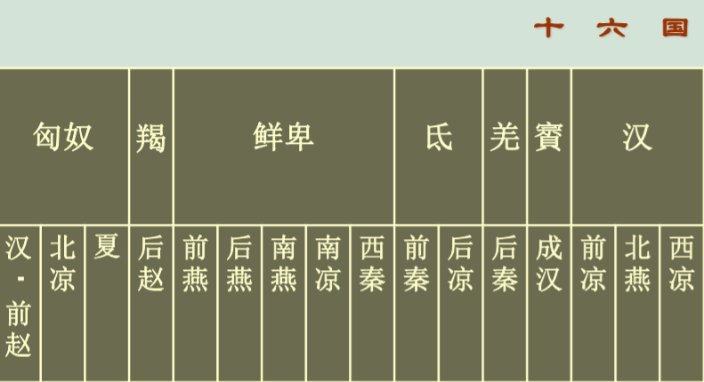
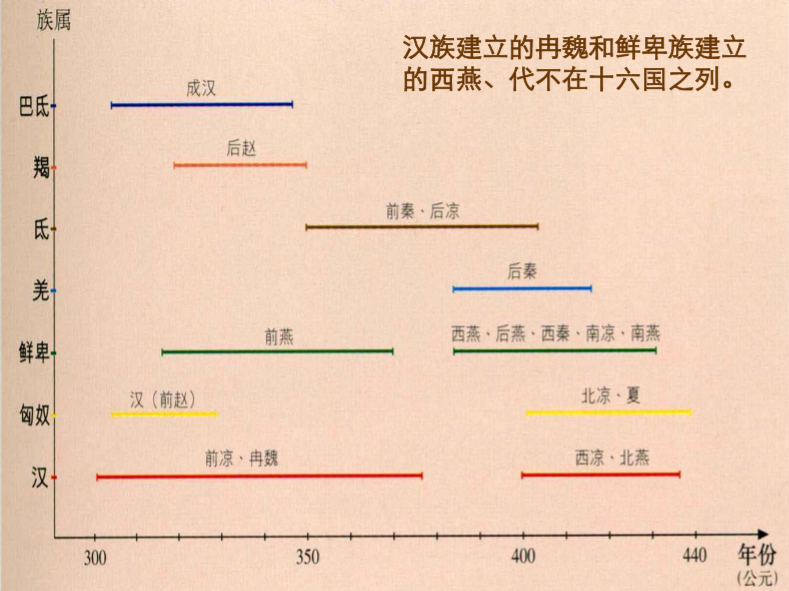
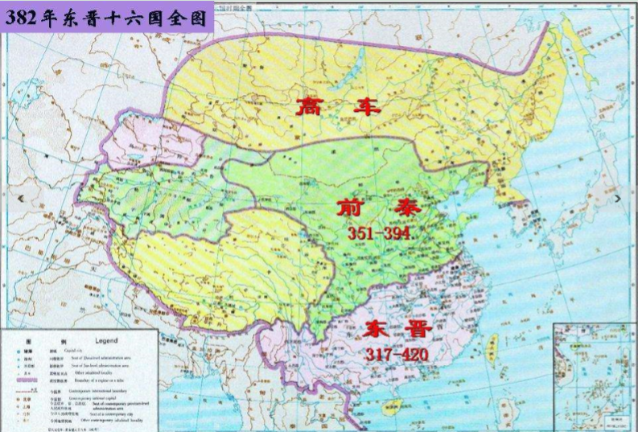
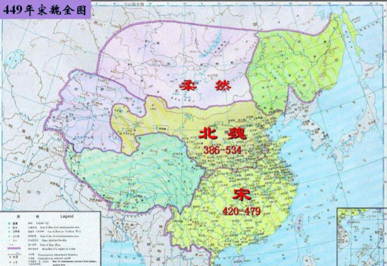
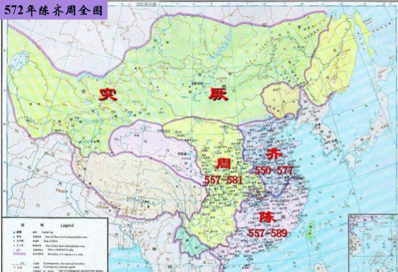
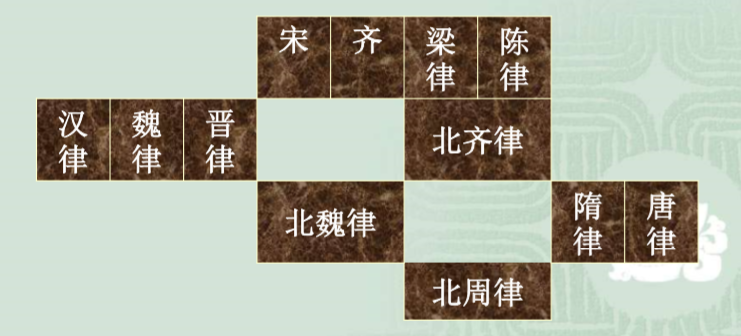
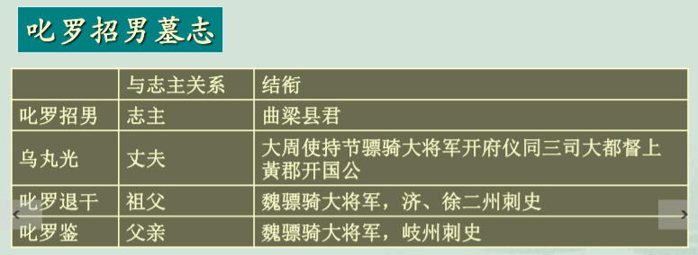

## 十六国北朝政治大势
十六国民族

<!--more-->

十六国年代时间轴

由南强北弱到北强南弱，分隔点大致是北魏建立之后瓜步之战。

南北朝后期，北齐，北周东西对立，陈相对弱小。北齐，与北周，加上北方强大的突厥帝国，有学者认为构成后三国政治。北齐，北周争先与突厥交好。

前秦的统一（376） —— 淝水之战（383）
北魏的统一（439） —— 瓜步之战（450） 
北周的统一（577） —— 平陈之战（589） 

### 前秦（351-394）之统一 
淝水之战后，对前秦的军事力量打击并不大。前秦的内部问题导致其分裂。分裂为后秦，后燕。
> 淝水之战后，姚苌回关陇，羌族反 秦。“慕容垂擅兵河北，泓、冲寇 逼京师，丁零杂虏，跋扈关、洛， 州郡奸豪，所在风扇，王纲弛绝， 人怀利己”。         ——《晋书》卷一一五《符丕载记》 

北方相对东晋南朝皇权较大。
东晋皇权低迷，北方汉赵之异族军事专制却明显强化。
> 后赵石虎“又立私论朝政之法，听吏告其君， 奴告其主。公卿以下，朝觐以目相顾，不必复相过从谈语”。   ——《资治通鉴》卷九七《晋纪十九》 （古人认为只在暴秦出现过0.0）

### 北魏（386-534）的统一 
北魏（拓跋鲜卑）起源于大兴安岭地区，属于东胡。
**考古发现**：1980年，在内蒙古呼伦贝尔盟鄂伦春自治 旗嘎仙洞内之石壁上发现了北魏太武帝祭祖时镌刻的祝文。 
北魏太武帝拓跋焘在位时（423-452），先后灭匈奴族夏赫连氏（431年）、北燕冯氏（436年）、卢水胡北凉沮渠氏（439年），统一黄河流域。与刘宋对峙， **形成了南北朝的局面**。  
450年，**瓜步（今江苏六合县东南）之战（刘宋的第二次北伐）**后，刘宋之防线渐撤至淮南，北方的实力已经压倒南方。 

北魏分裂为东魏，西魏。

### 北周（557-581）之统一 
北周武帝宇文邕，560-578 年在位，572年杀权臣宇文 护之后亲政，建德六年 （577）亲征北齐，攻破北齐都城邺城，俘北齐后主， 统一北方。 

### 为什么北朝统一全国
国家控制人口差异。
**南朝**：
> “王师岁动，编户虚耗，南北权豪竞招游 食，国弊家丰，执事之忧”。    ——《晋书》卷八八《颜含传》
> 梁“天下户口几亡其半”。     ——《南史》卷七○《郭祖深传》 

南朝经济上升，人口不应该大量减少。而国家控制人口减少，大多由于世家大族。

**北朝**：
> 北魏“正光（520-525）已前，时惟全盛， 户口之数，比夫晋之太康，倍而已矣”。   ——《魏书》卷一○六上《地形志》 

陈：五六十万户， 东魏：二百万户， 西魏：未知。

*南北朝分裂数百年，为何南北朝都想统一？*
> 田余庆：通观三国两晋南北朝时期的南北战争，似乎可以 归结为如下一种认识。由于中国历史具有统一的传统，凡 是统治北方的势力，都认为分裂是不正常的暂时现象，都 不自安于南北分裂状态，都企图南进以求统一。反过来， 南方的政权，大体也是这样。 

## 胡化汉化与北朝主流论
### 胡汉杂糅和胡汉分治 
“胡汉杂糅”，就是胡制和汉制交织。  
“胡汉分治”，就是对胡人和汉人的采用不同行政编制。 
> 刘聪“置左右司隶各领户二十余万，万户置 一内史，凡内史四十三。单于左右辅，各主 六夷十万落，万落置一都尉”。 

在十六国和北魏前期特点明显。 
### 北魏汉化与六镇胡化 
#### 北魏汉化
汉化，有的学者认为是为了统治需要，利用汉文化来统治，在辽金元清（对自身文化很有认同）更为明显。
北魏孝文帝在位（471-499）期间， 可以490年分为两个阶段，前主要是冯太后秉政，后为孝文帝亲政。 两个阶段的主要趋势都是汉化改革。 
孝文帝于490年开始亲政，491年，确定北魏在五行中之位次，将东晋南朝宋齐、十六国定为僭伪，北魏承西晋之金德为水德，表明中华正统地位。 
太和十八年（494）由平城（今大同）迁都洛阳、改革官制 。

1. 定姓族、改汉姓 
诸功臣旧族自代来者，姓或重 复，皆改之。
2. 禁止鲜卑服饰、鲜卑语言 
“断诸北语，一从正音”。 
3. 鲜卑贵族死后不能归葬 

北魏汉化有文化上自发同化的意味。
#### 六镇胡化
北魏初年为防范柔然，在平城以北，阴山以南，自西而东设置六军镇。

六镇军官难以升迁。
> 征镇驱使，但为虞候白直，一生推迁，不过军主。然其往世房分留居京者得上品通官，在镇者便为清途所隔。……少年 不得从师，长者不得游宦，独为匪人，言者流涕。                                     ——《魏书》卷一八《元渊传》  

> 边塞六镇之鲜卑及胡化之汉族，则仍保留其本来之胡化， 而不为洛都汉化之所浸染。故中央政权所在之洛阳其汉化愈深，则边塞六镇胡化民族对于汉化之反动亦愈甚，卒酿成六镇之叛乱。                                         ——陈寅恪 

六镇之乱（523-525）直接导致了北魏的瓦解。随后的**东魏北齐**和**西魏北周**政权，都源于六镇。 
**河阴之变后**
东魏的元魏宗室女子多嫁给高欢家族及其它六镇勋贵。 迁洛集团与六镇集团之间的鸿沟通过联姻而减小甚至弥合， 二者在新的政治形势下结合在了一起，构成了新的统治集团。 
**之后的“胡化”**
东魏北齐重新使用鲜卑语，还出现了“鲜卑共轻中华朝士” 的情况。  
北魏孝文帝改鲜卑姓为汉姓，而西魏宇文泰反其道而行之， 不但恢复了胡族诸将的胡姓，还向汉人广赐胡姓。 
不论是复汉姓还是赐胡姓，目的都是加强社会的整合，结果都是有助于胡汉民族的融合。
**胡化并不是西魏复赐胡姓的目的**
第一，宇文泰复、赐胡姓有具体的政治目的，复、赐胡姓的 直接目的是在工具层面，而非胡化、汉化的价值层面。这与 孝文帝改鲜卑姓为汉姓的意义有所不同。  
第二，西魏北周宇文泰在赐功臣以鲜卑姓的同时，还经常赐功臣以名字，所赐均为汉字雅名，无一是鲜卑语名。可见， 即使仅从宇文泰赐姓名的角度看，也不能以单一的胡化来概 括。  
第三，在复、赐胡姓的同时，宇文泰还模仿《周礼》，建立 六官体制，可被视为汉化。因此，从宇文泰改革措施的整体 来看，不仅仅是单纯的胡化、汉化，或者说已经跳出了胡化、 汉化，显示出其整合胡族与汉族，并别觅一途、标新立异、 创立新制度的取向。

### 北朝的雄健之风
> 丈夫生世，会须履锋刃，平寇难，安社稷以取功名；安能 碌碌依阶资以求荣位乎?                                                            ——《周书》卷一五《李弼传》 
> 每言男儿当横行天下，自取富贵，谁能端坐读书作老博士也。                                                        ——《北齐书》卷二一《高昂传》 
### 北朝官僚制发展
法律是官僚制发展基础
> 自晋氏失驭，海内分裂，江左以清谈相尚，不崇名法。 故其时中原律学，衰于南而盛于北。**北朝自魏而齐而隋而唐**，寻流溯源，自成一系，而南朝则与陈氏之亡而俱 斩。窃尝推求其故，而知南朝诸律，实远逊于北朝。          ——程树德《九朝律考 · 南朝诸律考序》 

对官僚们的行政业绩进行考课，是行政秩序的基本保证。 
> 北魏：“世祖亲考内外，大明黜陟”。 
> 北齐：樊逊“考为清平勤干，送吏部”。 
> 北周：郑孝穆“下车之日，户止三千。……数年之内，有四万家。每岁考绩，为天下最”。 

### 北朝主流论
从政治（皇权）角度：
> 从宏观考察东晋南朝近三百年总的政治体制，主流是皇权政治而非门阀政治。……从宏观来看东晋南 朝和十六国北朝全部历史运动的总体，其主流毕竟在北而不在南。                                                                  ——田余庆   
> 与南朝相比，北朝的官僚政治在 运作上更为富有效能，而且在制 度上赢得了众多进步。所以我们 认为，北朝的强盛来自体制的力 量，而体制的进步活力，则可以 最终归结为北方的独特历史道 路。……交替的“胡化”和“汉 化”孕育出了强劲的官僚制化运 动，它扭转了魏晋以来的帝国颓 势，并构成了走出门阀士族政治、 通向重振的隋唐大帝国的历史出 口。                                                ——阎步克 

### 南朝化理论
从唐后半期的经济角度：
> 唐后半期之税制，与南朝税制颇多相似之点。归纳言之， 大端凡二：一曰多以资产定税，二曰多取农业以外之工 商诸业。……南北朝经济有一大区别，即北朝专主农业， 而南朝工商并盛。大唐统一之后，政治上得较长时期之 安定，工商诸业，突飞猛晋，全国经济情况，渐变为南 朝社会之放大。              ——杨联陞《中唐以后税制与南朝税制之关系》（1937年） 
> 唐代经济、政治、军事以及文化诸方面都发生了显 著的变化，它标志着中国封建社会由前期向后期的 转变。但这些变化，或者说这些变化中最重要的部 分，乃是东晋南朝的继承，我们姑且称之为“南朝 化”。 南朝继承魏晋以来历史发展的轨辙，而北朝则由于 战祸和北方各族政权的建立，越出了这个发展轨辙。       ——唐长孺《魏晋南北朝隋唐史三论》 

**隋唐时期，由于北朝时期的民族融合，五胡只剩下羌一族。**
> 汉族的壮大并不是单纯人口的自然增长，更重要的 是靠吸收进入农业地区的非汉人，所以说是像滚雪球那样越滚越大。      ——费孝通《中华民族多元一体格局》 

## 附一个有趣的分析
**北周王光、叱罗招男夫妇墓志分析 **

叱罗招男墓志：

参见史料：
>北魏太和十八年（494）《孝文弔比干墓文》，在墓文碑阴題名中，有“直閤武卫中臣河南郡叱罗吐盖”。（为孝文帝八十一名随祭官之一） 
>东魏兴和三年（541）《元宝建墓志》：“祖相国清河文献王，祖母河南罗氏，父盖，使持节、抚军将军，济、袞二 州刺史。”（乃孝文帝外戚）

可以推知叱罗退干 ，叱罗吐盖，罗盖为同一人。那么，叱罗招男家族是孝文帝**迁洛集团**的核心家族之一。 

王光墓志：
祖“使持节、平南将军、并雍二州刺史广阳公买” 
父“持节、征东将军、零丘太守、干阳侯于” 。
但**二人均不见于文献**。

从墓志“衔命居边，守茲蕃捍，遂家朔土，绵历四世”，可以看出王光家族是**六镇集团**。

从墓志“天柱大将军尒朱荣率晋阳之甲匡定王室，援立孝庄，君预有力焉”。 参考文献中北魏末年，“北镇纷乱，所在峰起，六镇荡然，无复 蕃捍，惟〔尒朱〕荣当职路沖，招聚散亡”。   ——《魏书》卷一四《元天穆传》 ，可以看出王光家族参与了河阴之乱。

**那么迁洛核心家族与北魏六镇集团 为何联姻呢？**
叱罗招男（518-557） ，北朝女子的结婚年龄为13岁左右，则叱罗招男嫁给王光的 时间，当在北魏孝庄帝永安三年（530）前后，即河阴之 变（528）后不久。  
河阴之变，胡太后、幼帝及二千多名王公百官被杀。
猜测：**罗鉴一家虽逃过一劫，但需要尽快寻找新援。** 
再与历史联系，东魏的元魏宗室女子多嫁给高欢家族及其它六镇勋贵。 迁洛集团与六镇集团之间的鸿沟通过联姻而减小甚至弥合， 二者在新的政治形势下结合在了一起，构成了新的统治集团。 

**叱罗招男墓志称乌丸光，王光墓志称王君？**
胡汉姓氏的不同，也体现在这个时期其他墓志中。
可以看出，在此背景之下，已复、赐的胡姓，行用也不很严格，出现了复、 赐胡姓后依旧使用汉姓，或胡姓、汉姓并用的现象。 

